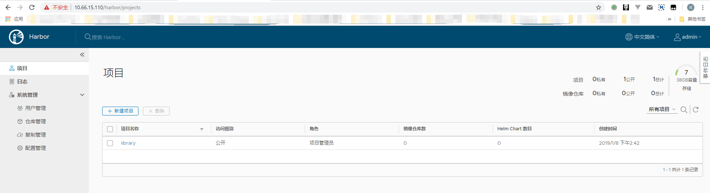
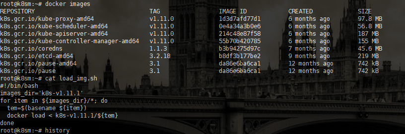
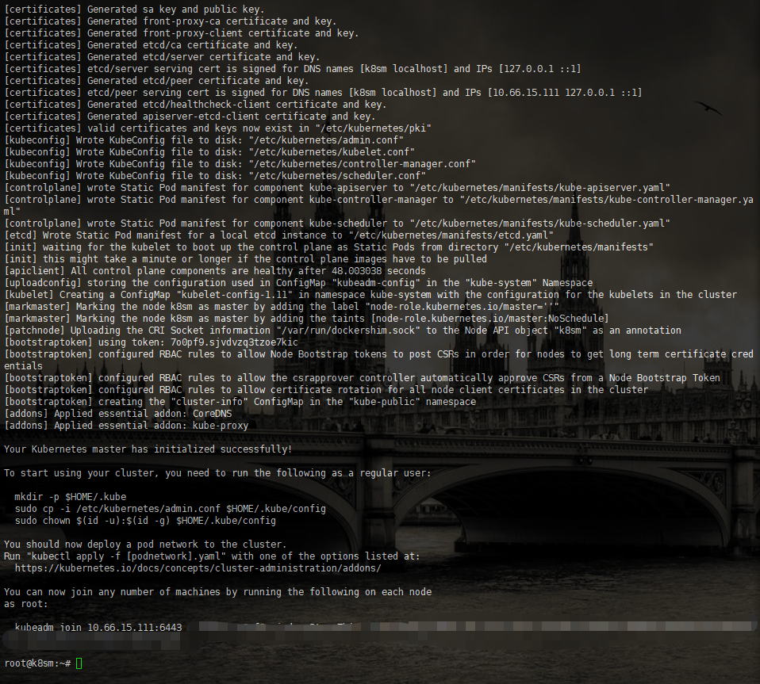
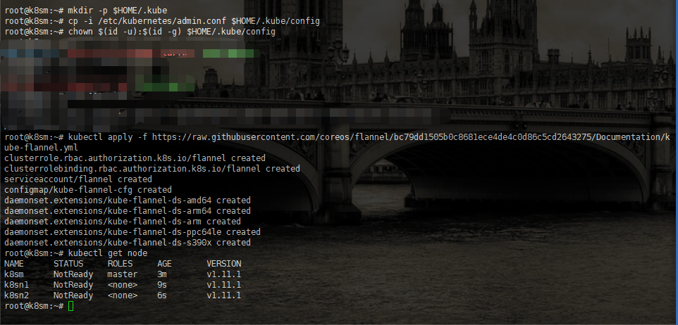
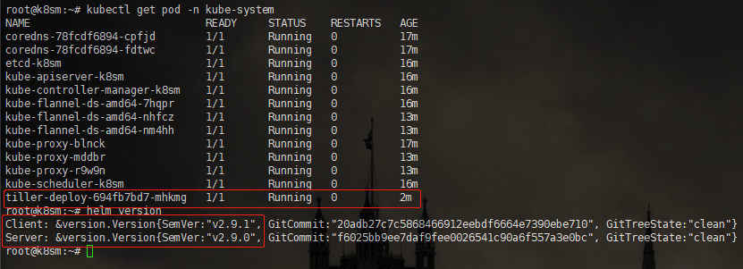

# k8s集群搭建及管理

虚拟机环境说明：
|主机名|角色|IP|
|-|-|
|harbor|私有镜像仓库|10.66.15.110|
|k_m|k8s master 节点|10.66.15.111|
|k_w1|k8s work 节点|10.66.15.112|
|k_w2|k8s work 节点|10.66.15.113|
版本说明：
* Ubuntu 16.04.5 LTS [download](https://mirrors.tuna.tsinghua.edu.cn/ubuntu-releases/16.04.5/ubuntu-16.04.5-server-amd64.iso)
* docker 17.03.3-ce

## docker安装
1. 使用USTC或者清华apt源[参见](https://mirrors.tuna.tsinghua.edu.cn/help/ubuntu/)
2. 安装docker-ce=17.03.3~ce-0~ubuntu-xenial[参见](https://yq.aliyun.com/articles/110806/)
3. 安装kubeadm kubectl kubelet kubernetes-cni[参见](https://juejin.im/post/5b8a4536e51d4538c545645c)

## harbor安装
最低安装配置
* 2 CPU
* 4G Mem
* 40G Disk

依赖包：
* Python 2.7+
* docker 1.10+
* docker-compose 1.6.0+ [安装参见](https://docs.docker.com/compose/install/#install-compose)
* openssl latest

**下载最新ofline安装包**
[下载地址](https://github.com/goharbor/harbor/releases)
**解压**
> tar xvf harbor-offline-installer-v1.7.1.tgz && cd harbor

**配置**
编辑harbor.cfg文件，配置hostname 为主机ip以及harbor_admin_password ，db_password ，clair_db_password 

**安装**
> ./install.sh

安装完毕后访问http://10.66.15.110 登录，密码cfg文件中设置的
成功截图：

## 使用kubeadm安装k8s v1.11.1集群
虚拟机至少需要2G内存，每台虚拟机上均安装docker，并下载对应版本的gcr镜像。安装v1.11.1版本镜像版本如下（用docker hub中lucheng事先中转构建的镜像，打包后批量导入）
```
s.gcr.io/kube-apiserver-amd64:v1.11.0
k8s.gcr.io/kube-controller-manager-amd64:v1.11.0
k8s.gcr.io/kube-scheduler-amd64:v1.11.0
k8s.gcr.io/kube-proxy-amd64:v1.11.0
k8s.gcr.io/pause-amd64:3.1
k8s.gcr.io/etcd-amd64:3.2.18
k8s.gcr.io/coredns:1.1.3
```
**关闭swap**
```
swapoff -a
sed -i 's/.*swap.*/#&/' /etc/fstab
```
**安装kubeadm等组件**
```
cat <<EOF > /etc/apt/sources.list.d/kubernetes.list
deb http://mirrors.ustc.edu.cn/kubernetes/apt kubernetes-xenial main
EOF
curl -s http://packages.faasx.com/google/apt/doc/apt-key.gpg | sudo apt-key add -
apt-get update
apt-get install kubelet=1.11.1-00 kubeadm=1.11.1-00 kubectl=1.11.1-00
systemctl enable kubelet
systemctl start kubelet
```
**拉取gcr镜像**
查看对应版本的镜像列表(工作节点只需要kube-proxy和pause)
```
root@k8sm:~# kubeadm config images list --kubernetes-version=v1.11.1
k8s.gcr.io/kube-apiserver-amd64:v1.11.1
k8s.gcr.io/kube-controller-manager-amd64:v1.11.1
k8s.gcr.io/kube-scheduler-amd64:v1.11.1
k8s.gcr.io/kube-proxy-amd64:v1.11.1
k8s.gcr.io/pause:3.1
k8s.gcr.io/etcd-amd64:3.2.18
k8s.gcr.io/coredns:1.1.3
```
新建并执行pull_image.sh，或者直接docker load镜像
* 拉取镜像
```
#!/bin/bash
images="kube-proxy-amd64:v1.11.0 kube-scheduler-amd64:v1.11.0 kube-controller-manager-amd64:v1.11.0 kube-apiserver-amd64:v1.11.0 etcd-amd64:3.2.18 coredns:1.1.3 pause-amd64:3.1 kubernetes-dashboard-amd64:v1.8.3 k8s-dns-sidecar-amd64:1.14.9 k8s-dns-kube-dns-amd64:1.14.9 k8s-dns-dnsmasq-nanny-amd64:1.14.9"

for imageName in ${images}; do
  docker pull lucheng/${imageName}
  docker tag lucheng/${imageName} k8s.gcr.io/${imageName}
  docker rmi lucheng/${imageName}
done
docker tag k8s.gcr.io/pause-amd64:3.1 k8s.gcr.io/pause:3.1
```
* 导入镜像
解压镜像压缩包
> tar zxvf k8s-v1.11.1-images.tar.gz

新建shell脚本
```
#!/bin/bash
images_dir='k8s-v1.11.1'
for item in ${images_dir}/*; do
  tem=$(basename ${item})
  docker load < k8s-v1.11.1/${tem}
done
```

**copy虚拟机**
**kubeadm init创建master主机**
Master使用flannel网络方案(calico网络方案性能更佳)，配置pod ip范围为10.244.0.0/16网段
> kubeadm init --kubernetes-version=v1.11.0 --apiserver-advertise-address=10.66.15.111 --pod-network-cidr=10.244.0.0/16

**配置kubenertes**
```
mkdir -p $HOME/.kube
sudo cp -i /etc/kubernetes/admin.conf $HOME/.kube/config
sudo chown $(id -u):$(id -g) $HOME/.kube/config
```

**Master节点网络设置**
开启桥接网络共享
> sysctl net.bridge.bridge-nf-call-iptables=1

配置flannel网络
> kubectl apply -f https://raw.githubusercontent.com/coreos/flannel/bc79dd1505b0c8681ece4de4c0d86c5cd2643275/Documentation/kube-flannel.yml

**kubeadm jion加入节点**
> kubeadm join 10.66.15.111:6443 --token *****--discovery-token-ca-cert-hash ***


## 配置k8s使用harbor私有仓库
在master节点上创建secret
```
kubectl create secret docker-registry harbor --docker-server=http://10.66.15.110 --docker-username=lc --docker-email=1@test.com --docker-password='***'
```
查看secrets
> kubectl get secrets

使用时在pod 的ymal文件中定义serviceAccount 为harbor

## 使用helm管理k8s应用
下载helm二进制文件并放至bin目录
[下载连接(GFW)](https://github.com/helm/helm/releases)
> mv helm /usr/local/bin/helm

赋予tiller创建和删除应用的权限
```
kubectl create serviceaccount --namespace kube-system tiller
kubectl create clusterrolebinding tiller-cluster-rule --clusterrole=cluster-admin --serviceaccount=kube-system:tiller
```

初始化helm需要安装tiller（GFW），直接docker 导入tiller镜像，或者使用阿里源完成初始化
* helm init时使用阿里源(推荐)
> helm init --upgrade -i registry.cn-hangzhou.aliyuncs.com/google_containers/tiller:v2.9.0

* 下载gcr.io/kubernetes-helm/tiller:v2.9.0 docker镜像后load
> docker load -i tiller-2.9.0.tar
> helm init -i gcr.io/kubernetes-helm/tiller:v2.9.0

helm 安装完成


### helm 使用
